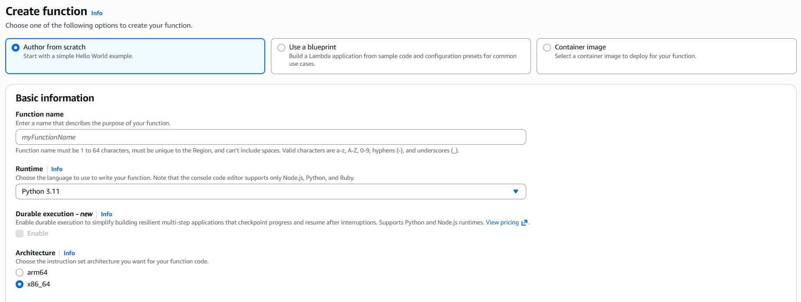
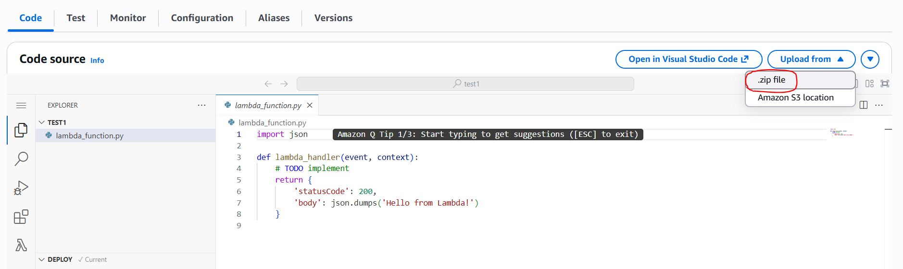
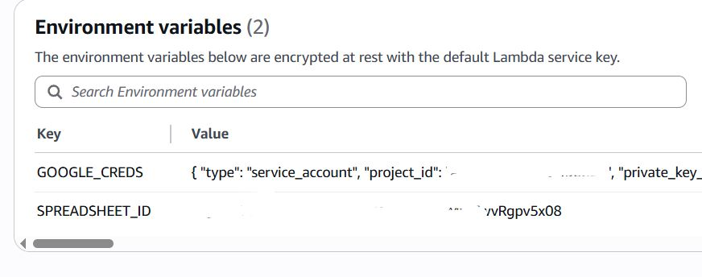
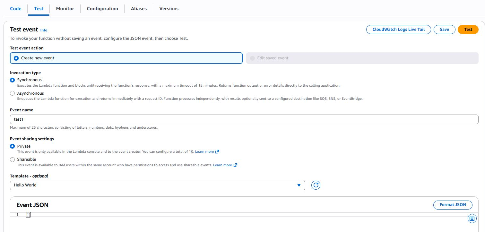
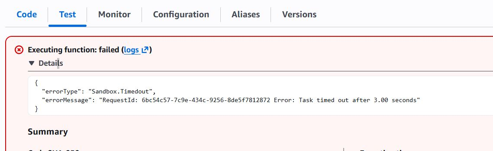
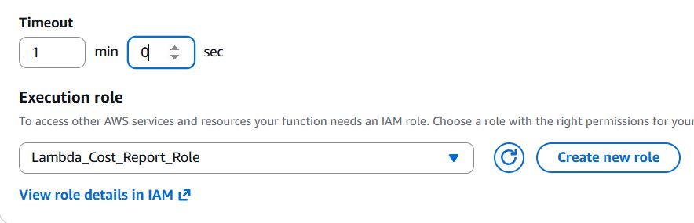
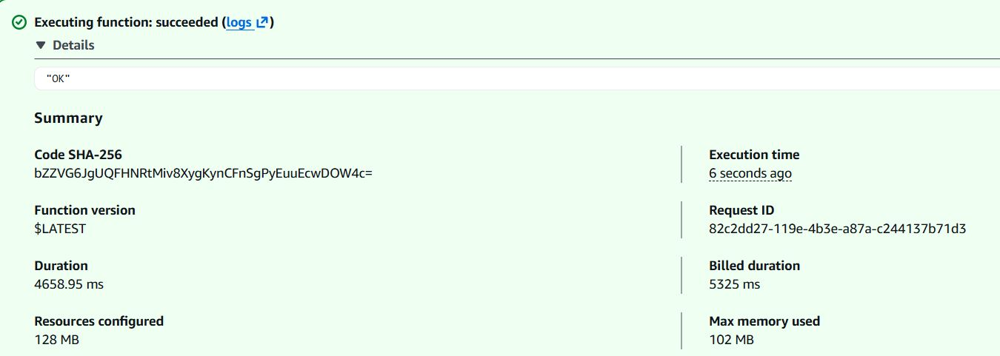
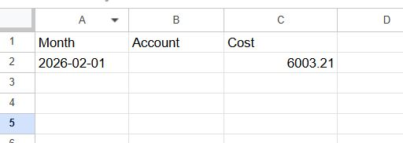

# 📊 AWS Cost Report → Google Sheets

## 🚀 Overview

This project collects AWS monthly cost data and automatically writes it to Google Sheets.

---

## Google Sheets Setup

### 1. Create Spreadsheet
1. Open Google Sheets  
2. Create a new spreadsheet  
3. Copy **Spreadsheet ID** from URL:

https://docs.google.com/spreadsheets/d/SPREADSHEET_ID/edit

---

### 2. Create Service Account
1. Go to Google Cloud Console  
2. Navigate to: APIs & Services → Credentials  
3. Create **Service Account**  
4. Generate **JSON key**

---

### 3. Enable API
Enable:
Google Sheets API

---

### 4. Share Spreadsheet
1. Copy `client_email` from JSON credentials  
2. Open your spreadsheet → click **Share**  
3. Add this email  
4. Grant **Editor** access  

---

## AWS Lambda Setup

### 1. Build deployment package (Linux)

Run container:
```bash
docker run -it --rm \
  --entrypoint /bin/bash \
  -v "$PWD":/var/task \
  public.ecr.aws/lambda/python:3.11
```

Install dependencies inside container:
```bash
pip install gspread google-auth -t /var/task
```

Exit container:
```bash
exit
```

Create ZIP archive:
```bash
zip -r ../lambda.zip .
```

---

### 2. Create Lambda function

- Runtime: **Python 3.11**  
- Architecture: **x86_64**  
- Upload: `.zip` archive  




---

### 3. Environment Variables

Set in Lambda:

```
GOOGLE_CREDS = <JSON content>
SPREADSHEET_ID = <your spreadsheet ID>
```



---

### 4. Test

Create test event:
```json
{}
```

Run the function.



---

## ⚠️ Notes

- Increase Lambda timeout (e.g. 30 seconds)  


- Ensure correct IAM role is attached (with Cost Explorer access)  


- Make sure the spreadsheet is shared with the service account  

---

## ✅ Result

After execution, the previous month's AWS cost data will appear in the Google Sheet.




---

## 🔄 Scheduling (optional)

You can configure an EventBridge rule to run the Lambda automatically (e.g. once per week or once per month).

Running the function multiple times will not create duplicate records —  
new data will only be added when a new month appears.
